# Laboratorio 3 cvds 

## Integrantes:

- David Felipe Velasquez Contreras
- Santiago Diaz Rojas

1. Creamos el proyecto de maven y añadimos las propiedades:
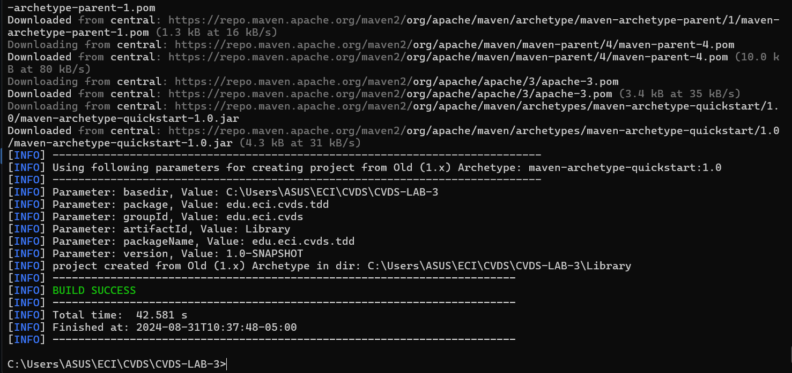
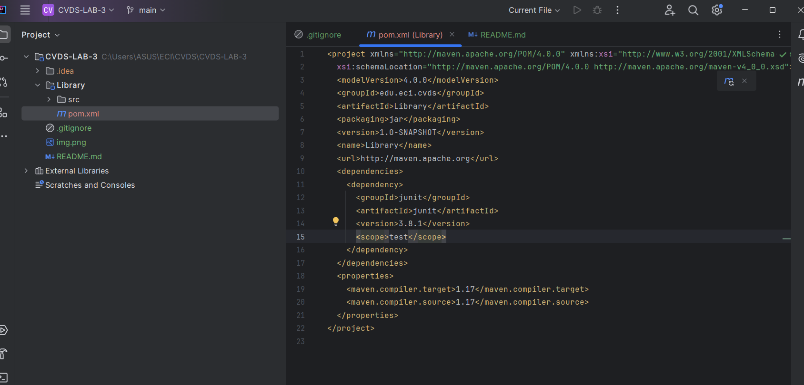

2. Creamos la distribucion del proyecto
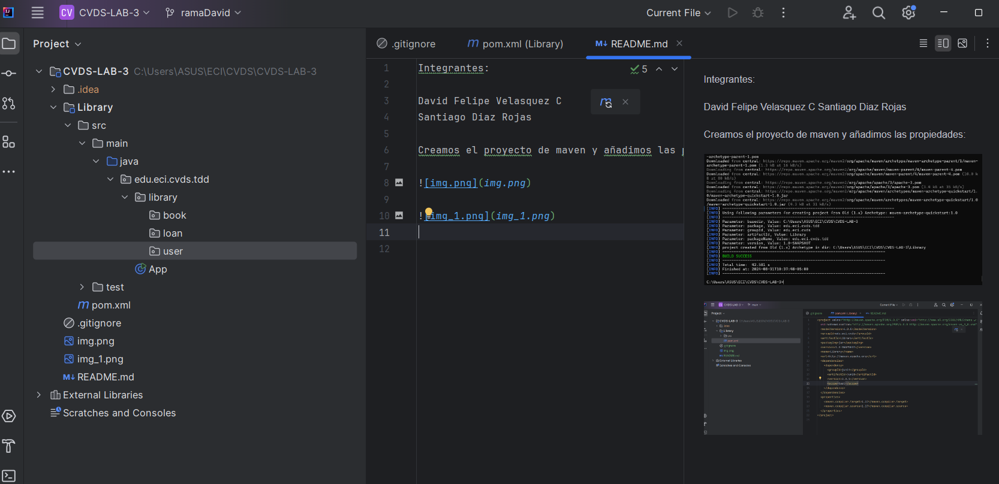

3. Ahora hacemos lo mismo pero en la carpeta de test
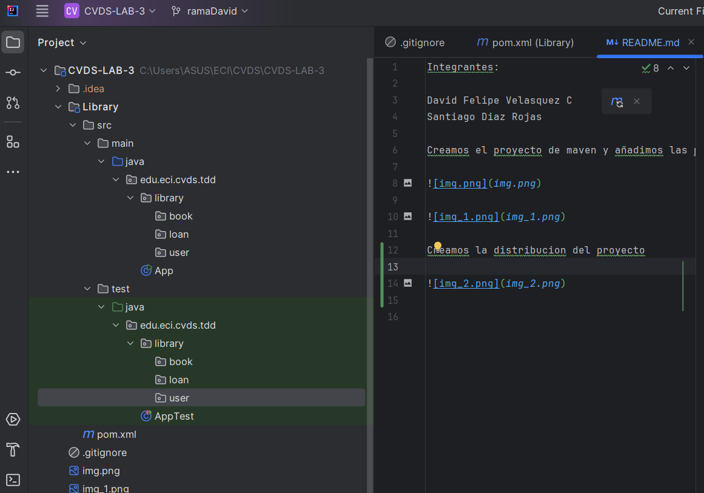

4. Validamos que el proyecto compile.
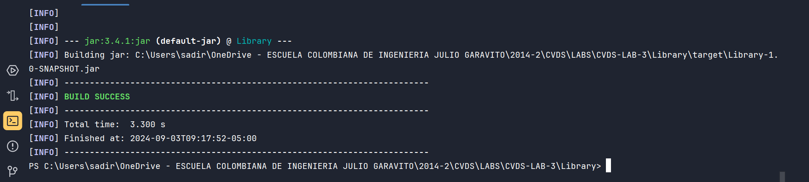
5. Ahora procedemos a crear las pruebas, por cada prueba vamos a hacer un commit y luego de las pruebas implementaremos metodo por metodo.
   - addBookSuccessfully
   - addBookIncreasesQuantityWhenBookAlreadyExists
   - addMultipleDifferentBooks
   - addBookFailsIfBookIsNull
   - addBookAndVerifyCorrectAmountAfterLoan
   - loanBookSuccessfully
   - loanFailsIfBookNotAvailable
   - loanFailsIfUserDoesNotExist
   - loanFailsIfUserAlreadyHasActiveLoanForSameBook
   - loanDateIsSetCorrectly
   - returnLoanWithNullLoan
   - returnLoanWhenLoanIsNotActive
   - returnActiveLoan
   - returnNonExistentLoan
   - returnLoanAlreadyReturned
6. Validacion de no aceptacion de pruebas:
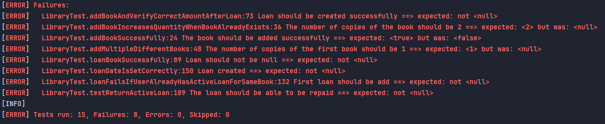
7. Implementacion de metodos:
   1. addBook
   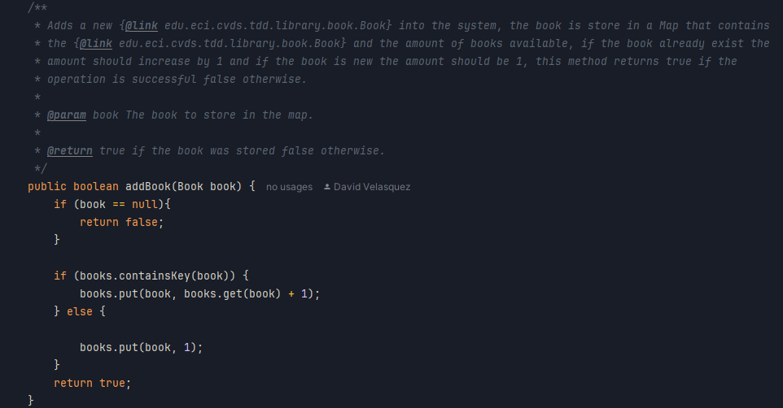
   2. loanABook
   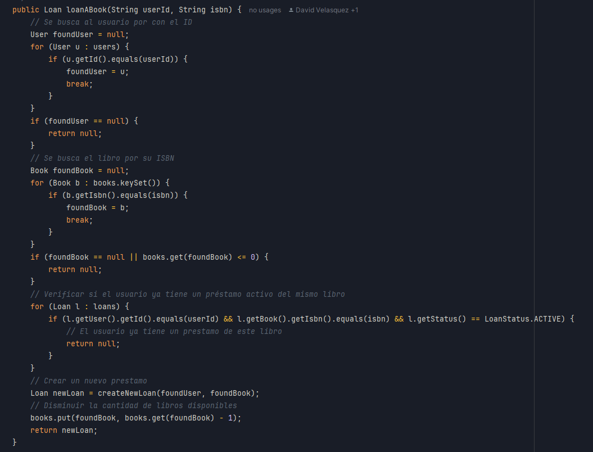
   3. returnLoan
   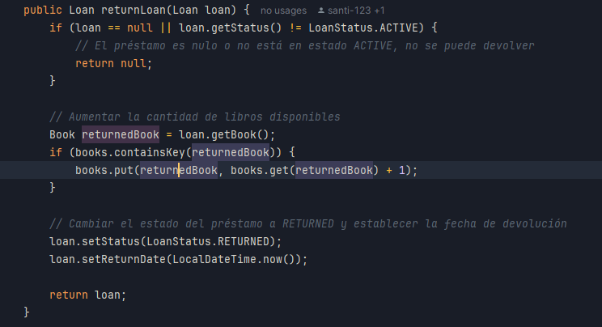
8. Validacion de aceptacion de pruebas:
   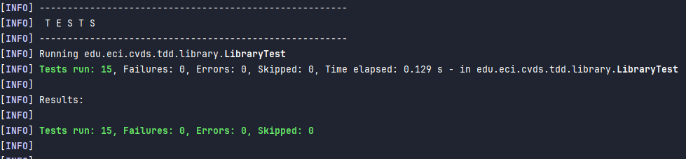
9. Validacion con integracion de Jacoco:
   1. Se logra una cobertura del 88%
   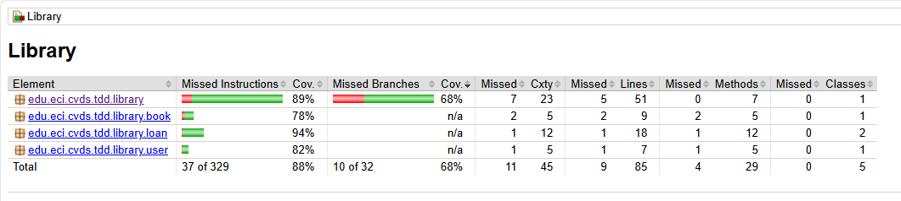    
   2. Si ingresamos a validar que parte de nuestro codigo tiene cobertura:
   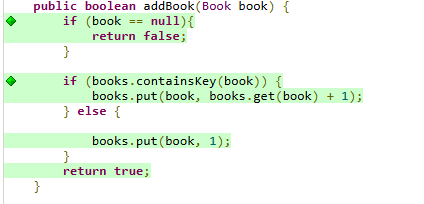
   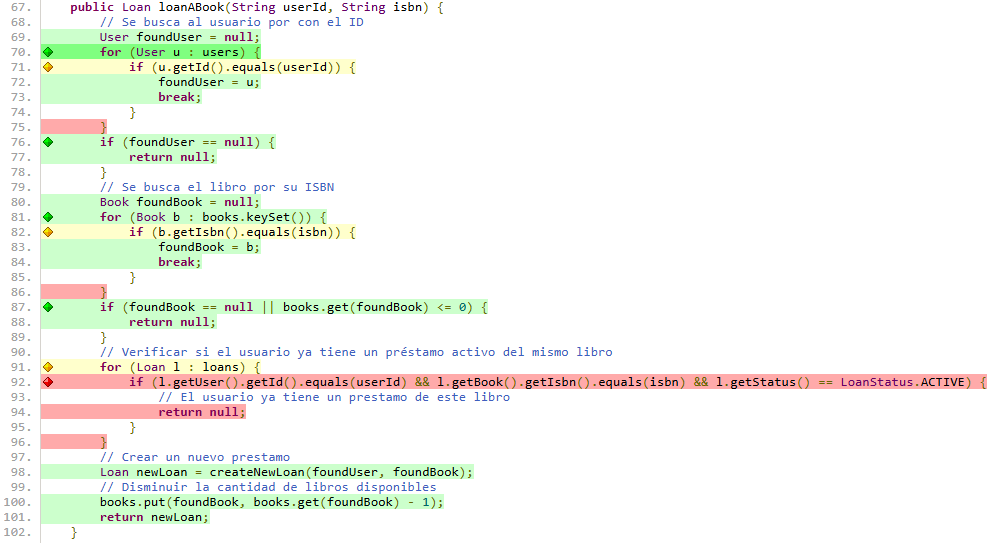
   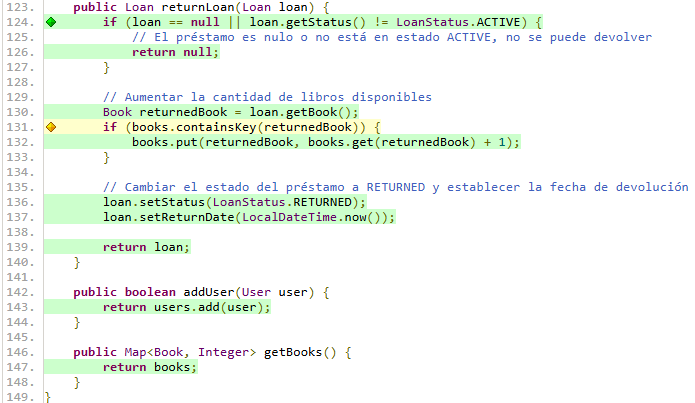
10. Validacion de integracion en Sonar Qube. Al momento de integrar esta herremienta a nuestro proyecrto generamos un token el cual nos permite revisar de manera online, el analisis estatico de nuestro codigo:
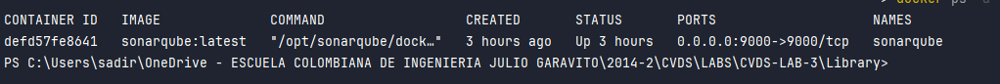
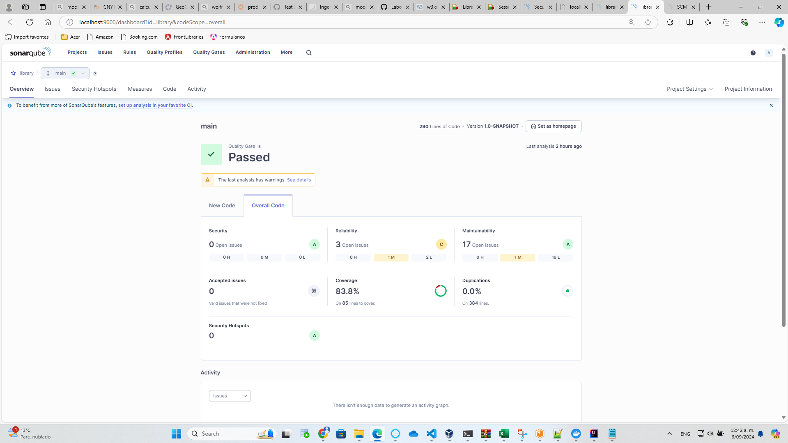
    - Como se puede ver se logra una covertura del 83.8%, lo que nos asegura que se esta cubriendo gran parte de nuesto proyecto con pruebas.